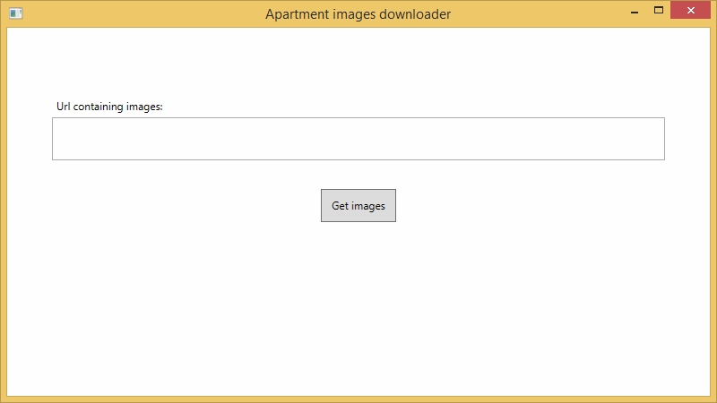

# ApartmentImagesDownloader

## Image downloader from various websites

ApartmentImagesDownloader allows to easily download and save images from URL from various supported websites. It automatically detects website and chooses specific method to extract images based on that website. 

Currently supported websites:
1. `aruodas.lt`

## When it is useful?

This application is mostly used when one wants to easily save apartment, with liked interior, images for future review.

## UI screenshot

